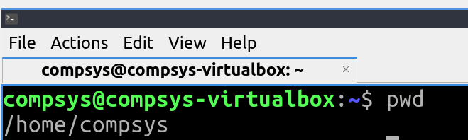
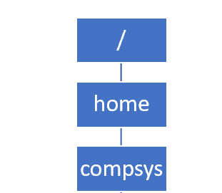
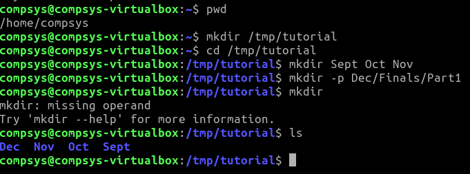
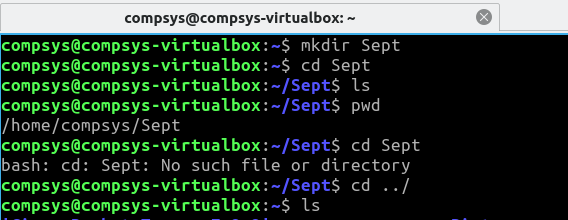

# Creating Files, Absolute and Relative Filenames

Create · Rename · Remove · Absolute · Relative Paths

Start by checking where you are currently located by **p**rinting your **w**orking **d**irectory (**pwd**):



## Filesystem Hierarchy Standard (FHS)

To help visualise where you are now in hierarchial structure:




## Create a **tmp** directory

To avoid accidentally trampling over any real files, start by creating a `tmp` directory to store temporary shell scripts:

```bash
$mkdir tmp
```

# Use of Relative File Paths

+ a location that is **relative to a current directory**.
+ points to a file relative to the current page.

Move inside this **tmp** directory, and create a new "**tutorial**" directory:

Move inside your "**tutorial**" directory and create the following subdirectories: 

```bash
$mkdir Sept Oct Nov
$mkdir -p Dec/Finals
```

+ QUESTION A: Use the man page to find out what the purpose of the argument **-p** 

ANS:?????

You will now have created the following directory hierarchy:


# Use of Absolute File Paths

+ the absolute path to the file is the path plus the name of the file
+ always contains the root element and the complete directory list required to locate the file

## EXER using absolute file paths: 

Return to the home directory using the **cd /** command

From home, use an absolute path to create a **Part1** directory nested within the **Dec** directory:


```bash
$mkdir ~/tmp/tutorial/Dec/Part1
$pwd
$ls -l ~/tmp/tutorial/Dec
$cd ~/tmp/tutorial/Dec/Part1
$pwd
```
(where the **~** represents your **home/compsys** directory)

Create a temporary `DecExamResults.txt` file just so you'll see a return when using your **ls** command, simply **store your name** into this file and save it

```bash
$nano ~/home/compsys/tmp/tutorial/Dec/DecExamResults.txt
$ls -l ~/home/compsys/tmp/tutorial/Dec
```

+ What happens if you try **mkdir** without ANY parameters?

```bash
$mkdir
```


Check you can see the files expected using `ls` (this screenshot shows some commands you should have used here):




- Navigate into this new `Sept` directory  

Have a look at the commands on this screenshot:



1. Are you confident you know what the commands are doing here?
2. Why was there a `No such file or directory`  error?

## Rename files

Rename the `Sept` directory to `September` using the syntax:

**$mv oldname newname**  

```bash
$mv Sept September
$ls
$pwd
```
Oops, you decided you shouldn't have done that so rename it back to `Sept`.

## Remove files

Remove this `Sept` directory using the **rmdir** command:


