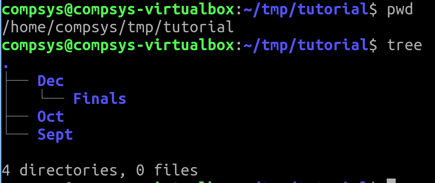
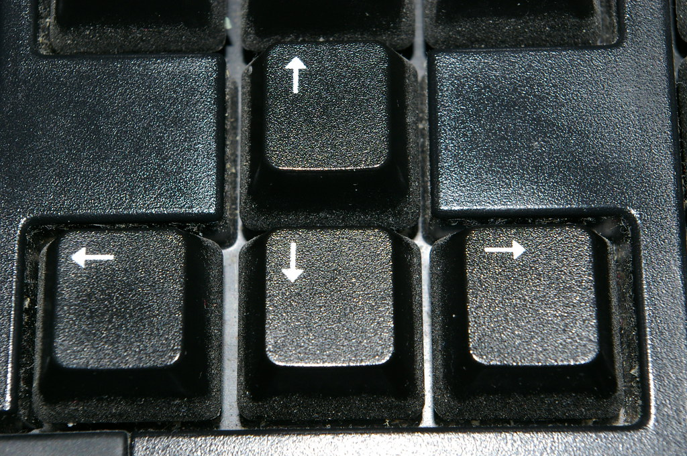

# Navigation Basics

Understanding Navigation

Try navigating through your filesystem using these basic commands in your Terminal:

```bash
$pwd
$cd /
$cd home
$pwd
$ls
```

Now, return to where you were when you first opened up the Terminal using the shortcut ... what was that?? 

# Relative File Paths

RECALL: the place you end up at depends on your ***current*** working directory.

What is the action of the following?

```bash
$cd ..
$pwd
$ls
$ls comp*
$pwd
$cd home/comp*
$pwd
cd 
$cd ../..
$pwd
```

Move into your tutorial directory created and have a look at it's structure using **tree**:



- From there, what is the action of:

```bash
$ls ../../
$cd ../../Down*
$pwd
```


# 2.Absolute Paths

RECALL: No matter what your current working directory is, absolute paths will have the same effect.

```bash
$ls /       #View the files in at the root
$cd         #Go to home directory
$cd /       #Switch to the root directory
$cd /etc    #Switch to the root/etc
```

## Handy shortcuts:

- using **/** at the start of your path means “starting from the root directory”.

- Using the tilde character (**~**) at the start of your path similarly means “starting from my **home/compsys* directory”.

```bash
$cd ~
$cd tmp/tutorial
$pwd
$cd ~/Desktop
```

TRY OUT THESE: be aware of where you are at all times (recall **pwd** command)

```bash
$cd
$cd /
$cd ~/Desktop
$cd /etc
$cd /var/log
$cd ..
$cd
```
## TIPS using the Terminal

1. Cluttered screen? ***clear*** off commands from your screen 
2. These commands can be added to any script so that they can become part of any automated script execution):

```bash
$clear
```

3.View a numbered list of your ***command history*** using:

```bash
$history
```

and then using, for example
-   **!3** to reuse command number 3 
- **!17** to reuse command number 17 etc.

4.Recall any ***previously used commands*** with your keyboard up/down arrows


DON'T FORGET to use commands like ***pwd, ls, tree*** to check where you are and what files are there!

# EXERCISE: What's the command?

1. You are in the ***home/compsys*** directory and you want to get to the ***/usr/bin*** directory using (1) absolute and (2) relative paths. 

2. to get from the ***/usr/bin*** directory to the ***/etc*** directory

# SUMMARY: TIPS ON FILE NAMES

A directory IS a type of file in Linux

A good rule of thumb is to keep your file names 

- begin with an UPPERCASE to begin a new word and the remainder primarily lower case
- with only letters, numbers, underscores and hyphens.  
- no spaces!!! 

Unix systems are ***case-sensitive***, that is, they consider “A.txt” and “a.txt” to be two different files. If you were to run the following lines you would end up with three files:

```bash
echo "Lower case" > a.txt
echo "Upper case" > A.TXT
echo "Mixed case" > A.txt
```


### Solution to QUESTION A earlier: 

With the **mkdir -p** command you can create sub-directories of a directory 

- if it does not already exist, **-p** will create a **Dec** parent directory
- if it does already exist, then it will NOT print an error message and will move further to create sub-directories, **Finals** and **Part1** directories nested within **Dec** directory

# EXERCISE

- Create the following directory structure that you will be able to re-use at a later date for your Assessment:

