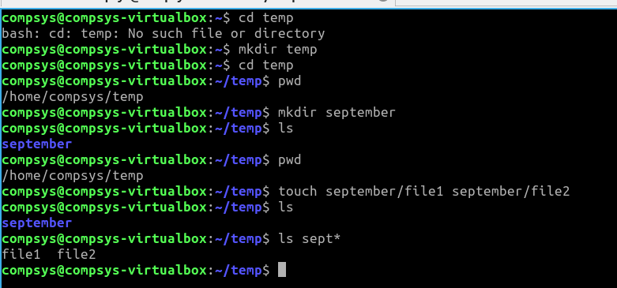
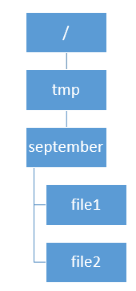

# File Manipulation

touch · cat · head · tail

# touch

The **touch** command is generally used:

1. to change the timestamps of a file or
2. to createa a file if it doesn't exist

TRY IT OUT:


This is what you should have created:



# cat

## `cat` to view a file contents

To view the output of a file called `file.sh`:
```bash
$cat file.sh
```


## `cat` to concatenate files 

For simplicity I've used the `>` redirection to redirect the STDOUT (which in this case is text strings) to three files, named simply **1,2,** and **3** 

We can then con**cat**enate the three files contents into one new file called **completeFile**

```bash
$echo 'Hi HDip Class' > 1
$echo 'Keep connected' > 2
$echo 'using Slack' > 3
$cat 1 2 3 > completeFile
$cat completeFile
```

## `cat` to copy files

```bash
cat completedFile > tempCopy
```

- and the opposite of `cat`??? `tac` of course!! 

Try it:

```bash
$tac tempCopy
```

# Viewing Larger Files

## head and tail commands

These allow you to view specific sections of a generally larger file than our examples created above, with uses such as:


- Can you see what's happening to the outputs of the `head` command?

- Swap the word `head` in the above command with the word `tail` for the above example

## EXERCISES

1. Write the command to print out the first 15 lines of the `/.bashrc` file

2. Write the command to print out the last 5 lines of the `/.bashrc` file

```bash
tail -5 ~/.bashrc
```
