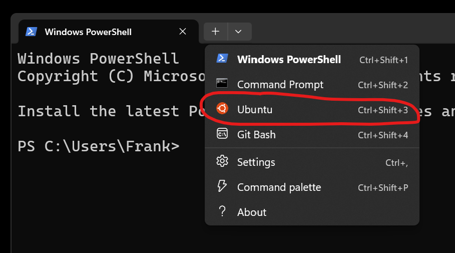

# Running a Bash Shell: Windows

Windows now comes with [Windows Subsystem Linux(WSL)](https://docs.microsoft.com/en-us/windows/wsl/about), which can give you access to Bash shell in Linux. To install Ubuntu on Windows Subsystem for Linux (WSL), follow these instructions:

### Enable WSL

1. Open PowerShell or Windows Command Prompt in **administrator** mode by right-clicking and selecting "Run as administrator".

2. Enter the following command to install WSL:

   ~~~bash
   wsl --install
   ~~~

   This command will enable WSL and install the default Linux distribution, which is currently Ubuntu.

3. Restart your machine

If you're running an older version of Windows (<10),  go to  **[WSL manual installation steps for older versions](https://learn.microsoft.com/en-us/windows/wsl/install-manual)**.

## Optional(but very advisable): Windows Terminal App

Microsoft’s Windows Terminal is a modern terminal environment including features that make it easy to open a Bash shell. You can get it here:

[https://docs.microsoft.com/en-us/windows/terminal/install](https://docs.microsoft.com/en-us/windows/terminal/install)

Once installed, you can easily access a Bash shell by selecting *Ubuntu* in the dropdown, similar to what is shown in the following image:

Happy Linuxing!....
