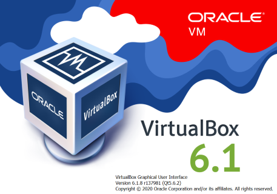
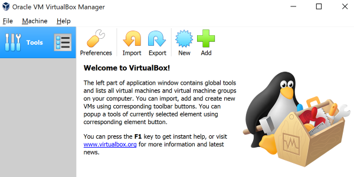
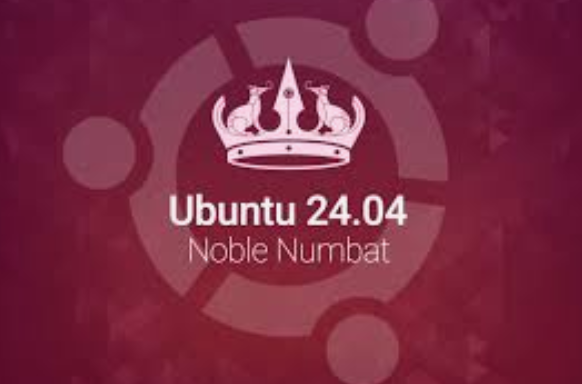
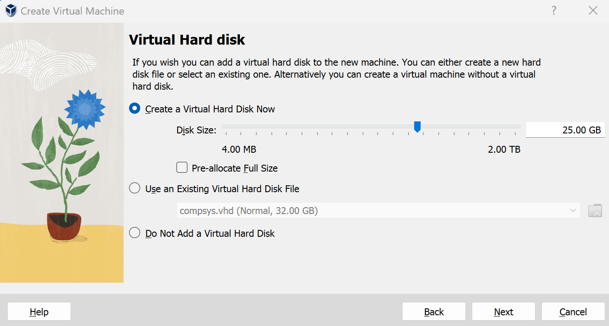
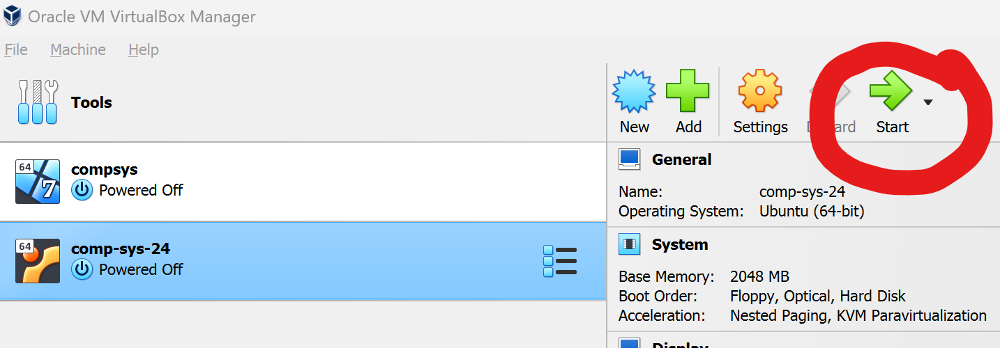
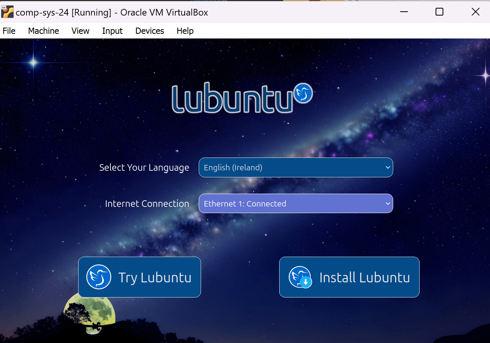
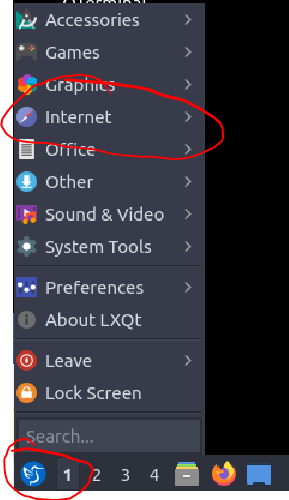
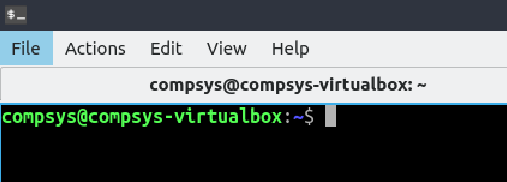
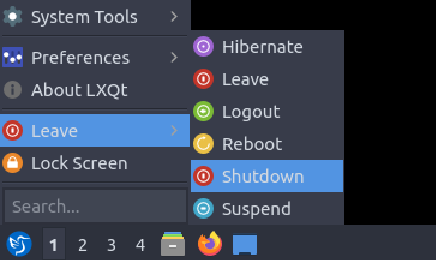

# Running a Bash Shell:  Using Virtualbox v6.1

You install a virtual Linux environment which will essentially be a computer within your laptop, in particular if you are new to the environment.

**WHY?** By using one consistent environment for the entire course we can avoid most of the boring problems and concentrate on the meat of the course instead. 

## STEP 1: Download and install Virtualbox 

Virtualbox is a *virtualisation hypervisor* which provides an environment to create and provision virtual machines.

You will be using Virtualbox to explore machine virtualisation and operating systems. This and subsequent labs have been developed and tested using **version 6.1**. 

To keep your development environment consistent with the labs, **you are advised to install this version**.

Select the appropriate download and install Virtualbox 6.1 for your operating system:

- [Windows](https://download.virtualbox.org/virtualbox/6.1.8/VirtualBox-6.1.8-137981-Win.exe)
- [OS X](https://download.virtualbox.org/virtualbox/6.1.8/VirtualBox-6.1.8-137981-OSX.dmg)
- [Linux](https://www.virtualbox.org/wiki/Linux_Downloads)

Ensure that Virtualbox has installed correctly by starting the application on your machine.

All going well you should see something similar to the following:

For more information about Virtualbox and installation, have a look around the [VirtualBox website](https://www.virtualbox.org/). 

# 2. Lubuntu 

## Install LUbuntu 24.04 (or the previous 22.04 version) in your Virtual Machine (VM)

LUbuntu Ver. 24.04 ("Noble Numbat") is supported for the usual 3 years = until April 2027.

## What is Ubuntu?

- Ubuntu is free/Libre Open-Source Software
- Ubuntu uses the ***Linux kernel***

The Linux kernel on its own, is not an operating system, but rather a set of computer instructions, that enable communication between software applications and the data processing done at the hardware level.

- LUbuntu is simply a **L**ightweight computer operating system based on **Ubuntu**.

## Recommended system requirements(LUbuntu)

Please read more on the [Lubuntu downloads page](https://lubuntu.me/downloads/) to help you in choosing the right version.

You should have

- 2 GHz dual core processor or better
- 2 GB system memory (be perfectly sufficient for what we will be doing)
- 25 GB of free hard drive space

 Also:

- Internet access!

## READY TO DOWNLOAD LUBUNTU?

(it's 2.5GB so give it a little time)

- Go to the [ver 24.04 downloads page](https://lubuntu.me/downloads/) 
- Choose the Desktop 64-bit image, which will begin your download of an *.iso* file:

## Add it to your Virtual machine

- Open Virtual Box and click "New" to create a new VM

and enter your details, such as:

In general, you can follow the settings below:

1. recommend assigning RAM of 4GB RAM size

2. "**create a virtual hard disk now**" option 

Now your machine is ready so **click Start**

## Install Lubuntu

- Amend the **Language** setting as you wish
- Choose your keyboard settings
  

- Choose to **Install Lubuntu**

Go down through the settings, choosing your preferences:

**NOTE:** 

1) it will ask you to **erase all** data but this is OK are you are now working inside a virtual machine on VirtualBox
2) REMEMBER your password

go ahead, install and we're ready to go... 

It will ask you to **Restart** and here, you'll see that it is only restarting your *VM*

# WELCOME TO LUBUNTU!!!!

Start by opening a Terminal window

- Go to the start menu in the bottom left
- System Tools
- QTerminal

## Want to add *Terminal* as a Desktop shortcut?

As we will use this lots, I recommend that you create a desktop shortcut: 

- Go to the start menu in the bottom left
- System Tools
- QTerminal
- Right click and "**Add Desktop Shortcut**" or simply click and drag the icon onto the desktop

# Basic Navigation

Here are a few navigation exercises and tests using LUbuntu:

## Internet Connection

- To test the network connection, click *Start -> Internet -> Firefox*, then type in [https://www.irishtimes.com/subscribe/student/](https://www.irishtimes.com/subscribe/student/) (are you aware you are eligible for a free student subscription?)

- If the website cannot be connected, check that the host computer (your computer) can access the same website.

## Terminal command window

- To access the terminal command window (CLI), click *Start -> System -> QTerminal*. 

## Shutdown

- To shut down the VM, click "Start -> Leave -> Shutdown".  
  

## Tutorials, tips and tricks

There are many many tutorials and resources available online to assist. Ubuntu also has a comprehensive [Tutorial page](https://tutorials.ubuntu.com/).

You may need to enable hardware virtualisation in the BIOS of your host machine.
Depending on your physical machine and environment, you may have to "tweak" Virtual Box and the Ubuntu instance to get it just right.
