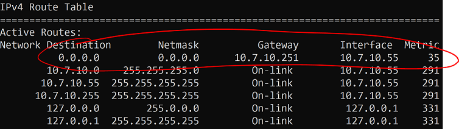
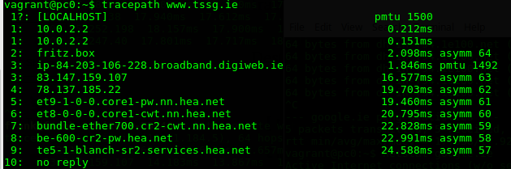
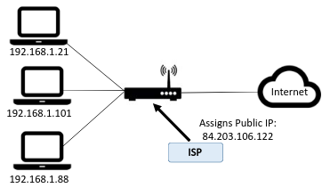

# The Local Network

## Introduction

You will now investigate your local network setup. From a networking perspective, it's a good idea to know:

- how you connect to the local network.
- the IP address you have on the internet.
- the network interfaces you have on your machine.

It may be useful to be able to investigate these details if you need to troubleshoot connectivity and network issues in later labs.  

## Your Local Network

You are likely to be using one of the following systems to connect to the internet:

- DSL/Fiber wired connection with a home router using an Internet Service Provider (e.g. Eir)
- Mobile Broadband router (sometimes known as a 'hotspot') provided by a mobile network provider (e.g. 3).
- 3rd party wireless provider or general apartment complex wireless connection. 

Most solutions will require that you have some form of physical device that can route network traffic from your home network and the internet (usually called **Router**). You can then connect your devices to the router and you're up and running! Every device that you connect must have a suitable network interface.

## Your IP address

An Internet Protocol address (IP address) is an identifying number for devices connected to a network. An IP address allows a device to communicate with other devices over an IP-based network, for example the internet.

- Open a terminal window on your machine and, at the command prompt, enter the following command for your Operating System:  

+ Windows: ``ipconfig``
+ Linux: ``ifconfig``
+ OS X: ``ifconfig``

You should see a summary of the network interfaces on your machine:

Your network set up will look different depending on various factors such as how you connect (wired, wifi) and how many network interfaces you have on your machine. More than likely, you should have at least 2 at the moment (assuming you completed the on-site lab); Ethernet(wired) and/or Wireless LAN (WiFi).

So how do you know which interface you're currently using to connect to the internet? Generally, your Operating System will select the connected interface with the highest speed. If you're 'wired' (usually 100mbit per second or 1000mbit per second) then that's the interface that will be used, otherwise it will fall back to wireless. 
You can usually deduce this from the ipconfig output. To know for sure, you can have a look at the routing table on your machine. The routing table shows what interfaces network traffic will be sent out on.

- On Windows,Linux and OS X, use the ``netstat –nr`` command to see a summary of the routing information. 
- Find the IPv4 Route table. You will see one entry indicated as default(or with a destination of 0.0.0.0). That's the interface used to connect to the internet. 

### Exercise
Using the above commands, answer the following questions:  

+ How many interfaces are listed on your machine?
+ What is the ip address of the interface are you using?
+ If not already, start up the virtual machine from the previous lab and run the ifconfig/ipconfig on your host machine again. Is there a new interface now? If so, why do you think it's there?

## PING

PING(Packet INternet Groper) sends ECHO_REQUEST packets to the IP address you specify. It’s a handy way to see whether your machine can communicate with the Internet or another machine. However many machines are configured **not** to respond to pings so, if you don't get a response, it doesn't  mean the machine is not connected and available for communication.

So you've all connected to the Wifi with your host machines So you should be able to ping each others host machines from your machine. Try the following:

+ Determine the ip address of your host machine on the local network.
+ Ask your neighbour (or help them) what their IP address is.
+ Ping them by typing *ping* followed by their IP address. All things going well you should see a successful response.

  

You can also use Ping to check if you can connect to the internet. Type **``ping google.ie``** to see if you can get a response from Google. This time, you should see something like this: 

Notice that you used a **domain name** this time. In this case, your machine would have used Domain Name System (DNS) to get the IP address for a "google.ie". As you can see, in this example the IP address is *209.85.203.94* and we got a successful reply so the virtual machine, pc0, is connected to the internet!  
We'll cover more about DNS in future coursework.

## Tracepath
Tracepath is a network troubleshooting utility which shows the number of "hops" taken by network "packets" to reach a destination and also determine the travelling path through the network. In the terminal session, type **``tracepath www.tssg.ie``** to see the path though the network to the tssg web site. You should see responses similar to the following:  

  

+ Also, do a tracepath using a neighbours IP address. Does it complete successfully and how many hops does it take?

## Private and Public IP addresses

  

You now know the IP address of your computer on your local area network(LAN). However, this is probably a "local" IP address that is just used in your LAN. It is not the IP address that the rest of the internet uses to interact with your computer. Your internet service provider will assign a single public IP address that is used by your computer (and all other devices on your LAN) and your router can translate traffic between local and public IP addresses. There are several  web services that can be used to find out your public IP address.  

- In a browser, go to [Google](www.google.ie) and search "what is my IP". You’ll see the Public IP address of your computer.

 

IP addresses are managed by the Internet Assigned Numbers Authority (IANA), which has overall responsibility for the Internet Protocol (IP) address pool. 
Your public IP address is usually based on a real-world location and can be used to estimate where you are. For example, your IP address can be used to give you weather forecasts for the town you're in or to advertise local services in the area. To see this in action, you can use several web sites that will display your IP address and location.  

- In a web browser, go to www.acuweather.com and see the result...
