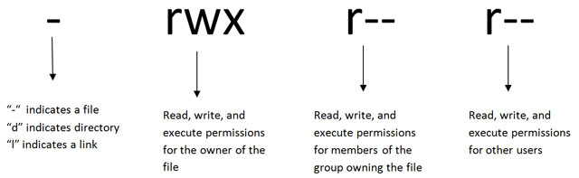

# Permissions

Executing and editing scripts 

## EXERCISE

**TIP: rename files**

Should you wish to rename files, you can use the **mv** command

Rename **numusers** to **stats**:

```bash
$mv numusers stats
```

To execute the commands contained in the file **stats**, all you now have to do is type **./stats** at the command line

```bash
$./stats
bash: ./stats: Permission denied
$
```

We don't have executable permissions to execute the **stats** file.

Let's review the files permissions

```bash
$ls -l stats
```

Before you can execute a script, you must make the script **executable**.

## chmod for File Permissions

Use the **chmod** (**ch**ange file **mod**es) command to do this:

```bash
$chmod 755 stats
$./stats
```



- Have a look at the new permissions:

```bash
$ls -l stats
```
Now, execute your file to see the output

## TIP

We could shorten this command again to

```bash
$chmod +x stats
```

## Use **echo** to improve the output

Make the output more user friendly by using the `echo` command along with `date`

- Amending your first line to

```bash
$echo "Welcome to class on " `date`
```
