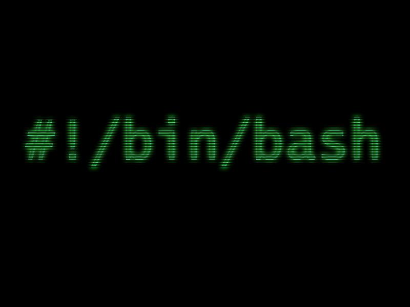

# Scripts

Script Basics · Shebang

Suppose you want to you want your script to print

1. the date and time,
2. the number of users logged in, and
3. your current working directory

## TIPS

+ The three command sequences you need to get the required output from your script are:

```bash
date, who | wc –l, and pwd.
```

## Create your script

1. Place the shell commands into a file and
2. then execute the file.

So let's open the **nano** editor and start our script

```bash
$nano stats
```

## Shebang line



The first line of a BASH script is called a shebang or a "bang" line.

It is nothing but the full path to the Bash interpreter so

+ add this shebang line in now
+ add the following commands:

```bash
date
who | wc –l
pwd
```

+ Add in some `echo` commands to make the output more user friendly
+ Add some comment lines to be beginning of the script to incl your name and a `Description` of your program
+ exit the nano editor, saving your changes

+ execute the script using the following command

```bash
$./stats
```